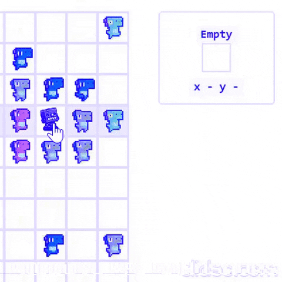

# Robots vs Dinosaurs Reagent

ClojureScript app to present simulations on an army of remote-controlled robots that fight dinosaurs!

[Click here to view live on Heroku](https://robots-vs-dinosaurs-reagent.herokuapp.com/)



## Contents
- [Overview](#overview)
- [Development](#development)
- [Deployment](#deployment)
	
<a name="overview"></a>
## Overview 

The **Reagent** client-side ClojureScript **SPA** app for **Robots vs Dinosaurs** which can be exposed with **Nginx** and deployed on Docker and Heroku.

The client-side app consumes the server-side app accepting and sending the `application/transit+json` format for faster communication.

---

<a name="development"></a>
### Development

#### Yarn

Install dependencies:

`yarn install`

Compile and watch using `shadow-cljs watch app` run:

`yarn dev`

---

<a name="deployment"></a>
### Deployment

#### Yarn

Clean `/target` and generated `/public/js` directories:

`yarn clean`

Run a release build optimized for production with `shadow-cljs release app`:

`yarn release`

#### Docker

To build and run the **Nginx** server with **Docker** container and the compiled `/public/js` execute:

```posh
docker build -t <image_tag> . && docker run -p 3000:30 --env PORT=30 --name robots-vs-dinosaurs-reagent <image_tag>
```

#### Heroku 

Login to Heroku's Container Registry:

```posh
heroku container:login
```

After building the image with **Docker**, push it to the Heroku's Container Registry:

```posh
heroku container:push web --app <heroku_app>
```

Then release the image to the app:

```posh
heroku container:release web --app <heroku_app>
```

---

## License

Copyright © 2019
